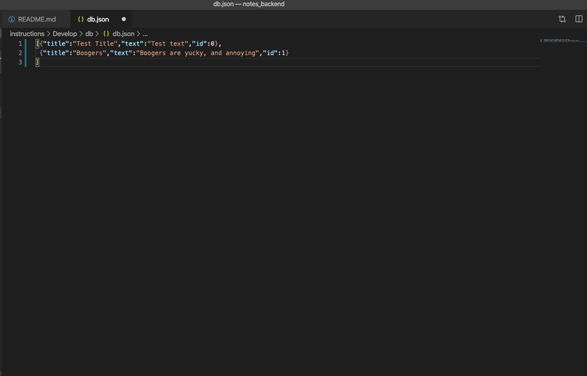
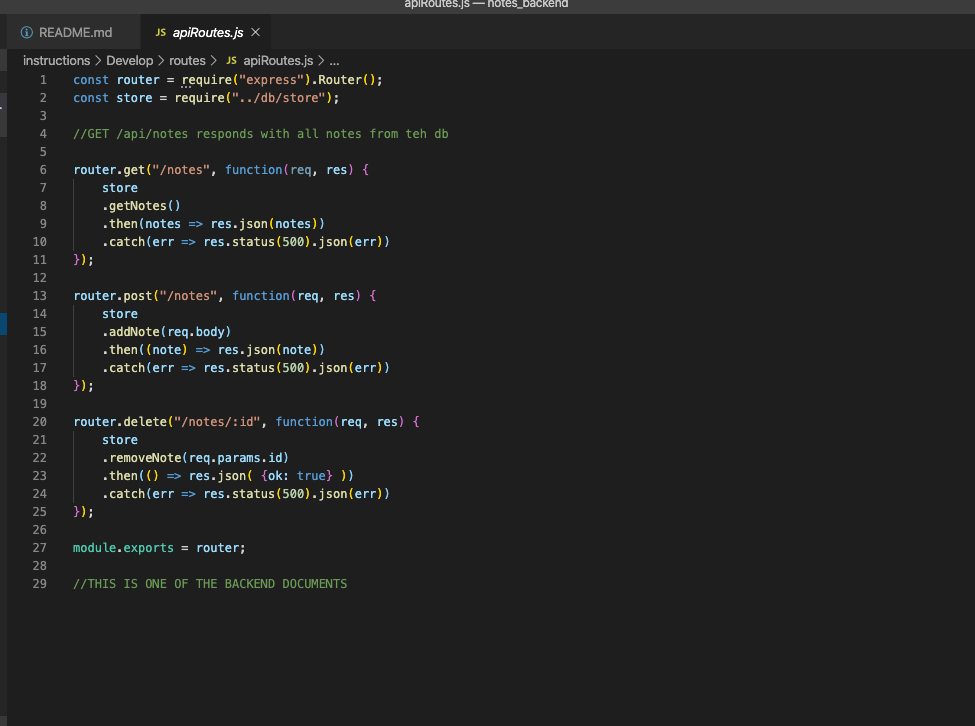
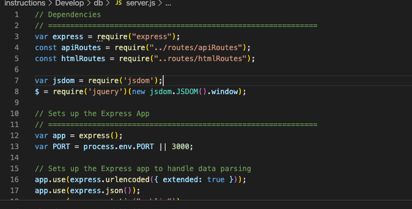
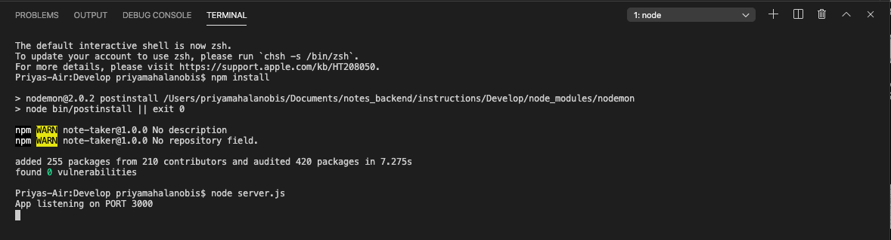

# Express Homework (Note Taker)

### GH Pages URL: https://pmahalan.github.io/notes_backend/

The purpose in my development of the Note Taker app was to build an application through which I would have practice with back-end (server-side) development. In addition to front-end user interactions, my computer also served as the server in this application via a localhost. 

A key aspect of this project's server-side is the database where the user's input is stored; the database is a file called "db.json". Each time a user writes + saves a note, information is taken from their input and saved to "db.json" via "key-value pairs". Keys (or property names) within db.json include: 'title', which refers to the title the user gives their note, 'text' which refers to the body of the note, and 'id' which refers to the unique numerical identifier of each note generated.

Another key aspect of this application was the inclusion + use of the node package "Express". While not technically essential to the deployment of any application, (since everything Express can do can be done in vanilla Node,) the utilization of Express makes for a simpler process when it comes to creating request endpoints.

